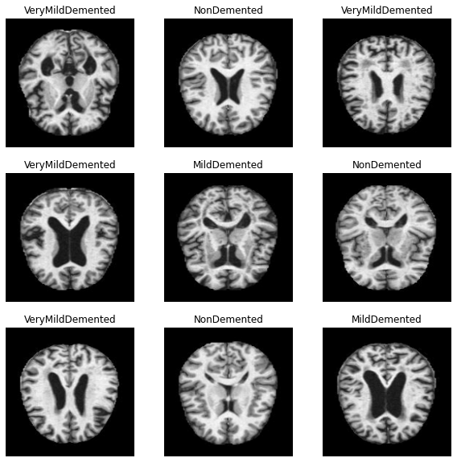
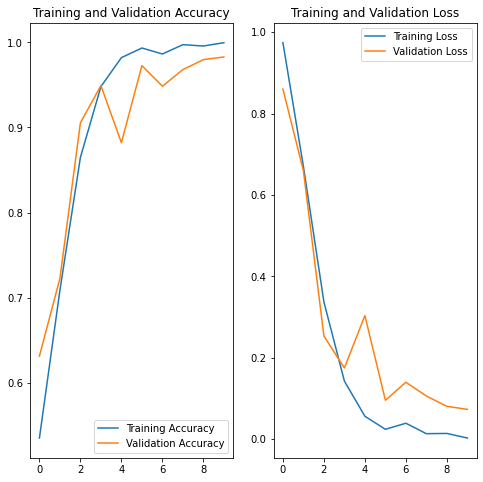

# project2-teamLAN
## Repository Contents 

## SRC
### Installing/Building the Code
Our approach will be a Convolutional neural network algorithm (CNN). To build the code, we're primarily utilizing the Keras API running on TensorFlow. 

The following packages will need to be installed in order to build the code: keras, tensorflow, plotly, htmltools, caret, NbClust, and dplyr.

### Code Usage

## Data
### Data Dictionary
| Column | Data Type | Description |
| --- | --- | --- |
| nonDemented | Image | MRI scan presents no signs of dementia |
| veryMildDemented | Image | MRI scan presents very mild signs of dementia |
| mildDemented | Image | MRI scan presents mild signs of dementia |
| moderateDemented | Image | MRI scan presents moderate signs of dementia (the most extreme) |

### Link to Data
[Data](https://www.kaggle.com/datasets/shahidzikria/alz-dataset) 

### Notes about Data
The data is composed of MRI scan images in JPEG format. The code found in the SRC file develops separate datasets to both train and test the convolutional neural network. The images belonging to the dataset categories are assigned a corresponding number label(nonDemented-0, veryMildDemented-1, mildDemented-2, and moderateDemented-3). 

## Figures 

| Figure | Image | Description |
| --- | --- | --- |
| Exploratory Classification |  | This figure was generated by the model to assess successful upload of images and correct disease progression label association. |
| Training and Validation Accuracy and Loss |  | The line plot on the left shows the accuracy of training and validation, while the plot on the right shows their loss. |

## References
A. Biswal, “Convolutional Neural Network tutorial [update],” Simplilearn.com, 16-Feb-2023. [Online]. Available: https://www.simplilearn.com/tutorials/deep-learning-tutorial/convolutional-neural-network. [Accessed: 16-Mar-2023]. 

“CNN-example,” Databricks. [Online]. Available: https://databricks-prod-cloudfront.cloud.databricks.com/public/4027ec902e239c93eaaa8714f173bcfc/2961012104553482/4462572393058129/1806228006848429/latest.html [Accessed: 16-Mar-2023]. 

“Basic image classification,” TensorFlow for R - Basic Image Classification. [Online]. Available: https://tensorflow.rstudio.com/tutorials/keras/classification  [Accessed: 14-Mar-2023]. 

“Alzheimer's disease facts and figures,” Alzheimer's Disease and Dementia. [Online]. Available: https://www.alz.org/alzheimers-dementia/facts-figures#:~:text=More%20than%206%20million%20Americans%20of%20all%20ages%20have%20Alzheimer's,older%20(10.7%25)%20has%20Alzheimer's. [Accessed: 14-Mar-2023].

“Alzheimer's disease,” Mayo Clinic, 02-Feb-2023. [Online]. Available: https://www.mayoclinic.org/diseases-conditions/alzheimers-disease/symptoms-causes/syc-20350447. [Accessed: 14-Mar-2023]. 

“Alzheimer's disease fact sheet,” National Institute on Aging, 08-Jul-2021. [Online]. Available: https://www.nia.nih.gov/health/alzheimers-disease-fact-sheet#:~:text=Changes%20in%20the%20brain%20may,amyloid%20plaques%20and%20tau%20tangles. [Accessed: 14-Mar-2023]. 

“ML Practicum: Image Classification  |  machine learning  |  google developers,” Google, 18-Jul-2022. [Online]. Available: https://developers.google.com/machine-learning/practica/image-classification/convolutional-neural-networks  [Accessed: 14-Mar-2023]. 

“Image classification,” TensorFlow. [Online]. Available: 
ttps://www.tensorflow.org/tutorials/images/classification  [Accessed: 14-Mar-2023]. 

“What is a decision tree,” IBM. [Online]. Available: https://www.ibm.com/topics/decision-trees#:~:text=A%20decision%20tree%20is%20a,internal%20nodes%20and%20leaf%20nodes. [Accessed: 14-Mar-2023]. 
